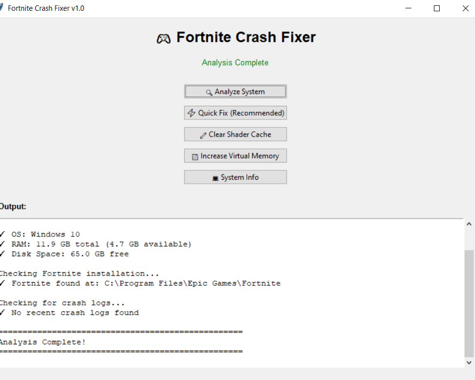
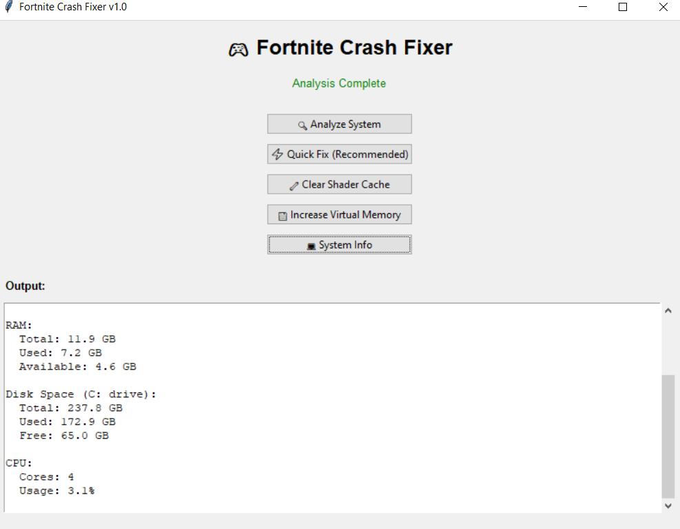

# 🎮 Fortnite Crash Fixer

Fix Fortnite crashes, errors, and performance issues on Windows quickly and easily.

---

## 🚀 Fix Fortnite Crashes Now

👉 Download here:
https://github.com/khx2012/fortnite-crash-fixer/releases/latest

---

## 📸 Screenshots

### Main interface

### System Analysis Tool

### System Information Viewer

---

## ⚡ Features

* 🔍 Analyze system performance for Fortnite
* ⚡ Quick Fix for common Fortnite crashes
* 🧹 Clear Fortnite shader cache
* 💾 Improve memory performance
* 💻 View detailed system information

---

## 🛠️ How to Fix Fortnite Crashes

1. Download Fortnite Crash Fixer
2. Run the application
3. Click **Analyze System**
4. Use **Quick Fix (Recommended)**
5. Restart your PC

---

## 🎯 What Problems This Fixes

* Fortnite crashing on startup
* Fortnite not launching
* Fortnite freezing or lagging
* Shader cache errors
* Low memory issues

---

## 💻 System Requirements

* Windows 10 / 11
* Fortnite installed
* 4GB+ RAM recommended

---

## 📦 Installation

1. Download the `.exe` from Releases
2. Double-click to run
3. Follow on-screen options

---

## ⚠️ Important Notes

* Close Fortnite before applying fixes
* Restart your PC after fixes
* This tool does not modify Fortnite game files

---

## 🔍 Keywords (for search engines)

Fortnite crash fix, fix Fortnite crashes, Fortnite not launching, Fortnite crash tool, Fortnite shader cache fix, Fortnite errors Windows

---

## 🧠 Disclaimer

This project is not affiliated with Epic Games.

---

## 🔗 Project Info

* Version: 1.0
* Platform: Windows
* Language: Python

---

⭐ If this helped you, consider starring the repo!

